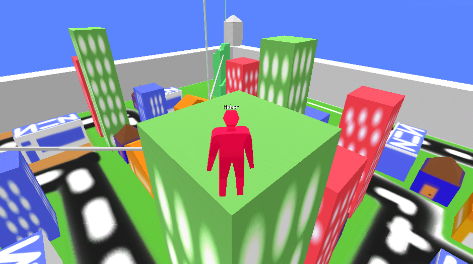
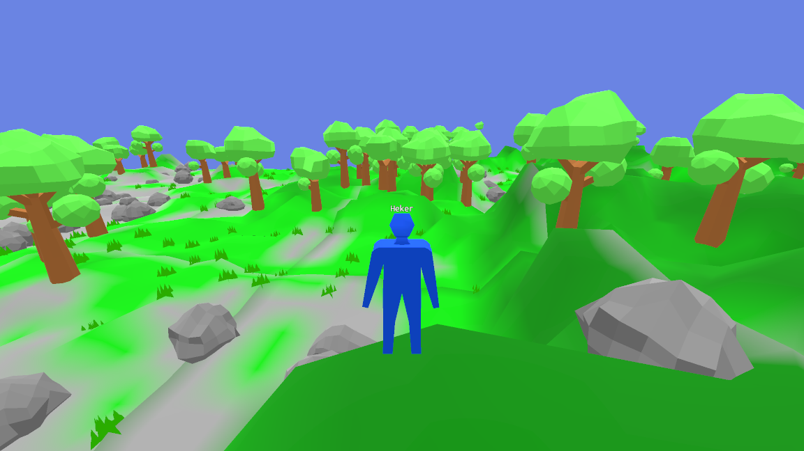
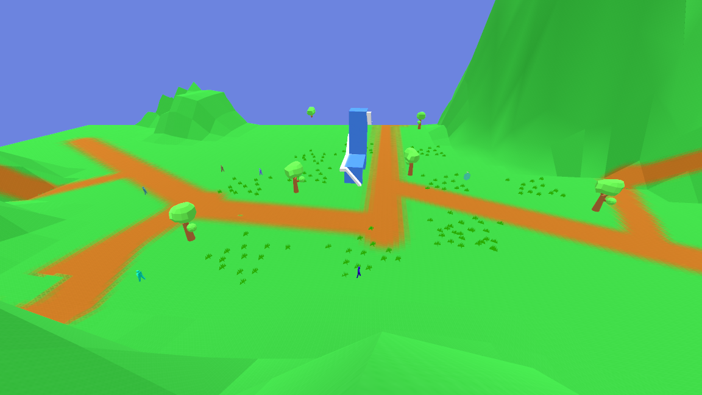

# Kuarkers The Game

Kuarkers adalah game absurd open world yang dapat dimainkan secara multiplayer, tanpa tujuan, dan Open Source.
Saya membuat project ini untuk melatih kemampuan saya dalam `Game Development`.
Punya saran atau menemukan bug? segera buat [issue](https://github.com/Riizlaah/kuarkers-g/issues)

## Preview

## Download
- APK
  - [Versi 1.0](https://github.com/Riizlaah/kuarkers-g/releases/download/1.0/Kuarkers-1.0.apk)
  - [Versi 1.1.0](https://github.com/Riizlaah/kuarkers-g/releases/download/1.1.0/Kuarkers-1.1.0.apk)
  - [Versi 1.1.1](https://github.com/Riizlaah/kuarkers-g/releases/download/1.1.1/Kuarkers-1.1.1.apk)
  - [Versi 1.2.0](https://github.com/Riizlaah/kuarkers-g/releases/download/1.2.0/Kuarkers-1.2.0.apk)
  - [Versi 1.3.0](https://github.com/Riizlaah/kuarkers-g/releases/download/1.3.0/Kuarkers-1.3.0.apk)
  - [Versi 1.3.1-dev](https://github.com/Riizlaah/kuarkers-g/releases/download/1.3.0/Kuarkers-1.3.1-dev.apk)
> Versi lebih lengkap ada di bagian [releases](https://github.com/Riizlaah/kuarkers-g/releases)
